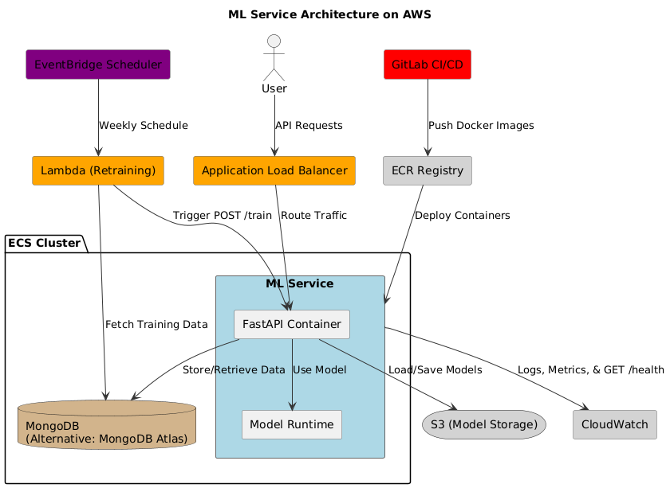

# ML Service Project



---

## Project Overview

This project is a **Machine Learning (ML) service** that provides a production-ready pipeline to:

- Ingest data  
- Train a model  
- Serve predictions via FastAPI (REST API)  

Built using **FastAPI**, containerized with **Docker**, and deployed to **AWS ECS**, the project features:

- Automated **CI/CD** with **GitLab**  
- **Monitoring** via **AWS CloudWatch**  
- **Scheduled model re-training** via **AWS Lambda + EventBridge**  

The service uses the Iris dataset (`data/iris.csv`) as a demo. Data is stored in **MongoDB**, and models are trained using **scikit-learn** with a `RandomForestClassifier`.

---

## Objective

Build a reliable and scalable ML service that:

- Accepts data via `POST /data`  
- Trains models via `POST /train`  
- Makes predictions via `POST /predict`  
- Returns training metrics via `GET /metrics`  
- Checks service health via `GET /health`  
- Deploys to **AWS ECS**  
- Re-trains automatically every week  
- Follows best MLOps and DevOps practices  

---

## 🛠️ Tech Stack

| Technology                    | Purpose                                 |
|-------------------------------|-----------------------------------------|
| **FastAPI**                   | REST API Framework                      |
| **Scikit-learn**              | ML Model Training & Prediction          |
| **MongoDB**                   | Data Storage                      |
| **Docker**                    | Containerization                        |
| **AWS ECS**                   | Service & DB Deployment                 |
| **AWS ECR**                   | Docker Image Registry                   |
| **AWS CloudWatch**            | Logs & Monitoring                       |
| **AWS Lambda + EventBridge**  | Scheduled Re-training                   |
| **GitLab CI/CD**              | Continuous Integration & Deployment     |
| **Pytest**                    | Unit Testing                            |
| **Python 3.12**               | Core Programming Language               |

---

## ⚙️ Setup Instructions

### 1. Clone the Repository
```bash
git clone https://github.com/MrJohn91/ml-service-project.git
cd ml-service-project
```

### 2. Run the App (with Docker)
Ensure **Docker** is installed and running.

Start the app and MongoDB:
```bash
docker-compose up --build
```

### 3. Access the Service
- Base URL: [http://localhost:8000](http://localhost:8000)  

---

## 💻 Developer Environment (Devcontainer)

A **devcontainer** is included for easy local development using **VS Code**.

### Steps:
1. Open the repo in **VS Code**  
2. When prompted, select **"Reopen in Container"**  
3. VS Code sets up Python, dependencies, and MongoDB automatically  

---

## 📡 API Endpoints

### Health Check
```http
GET /health
```

### Ingest Data
```http
POST /data
```
**Sample Payload:**
```json
{
  "sepal_length": 5.1,
  "sepal_width": 3.5,
  "petal_length": 1.4,
  "petal_width": 0.2,
  "species": "setosa"
}
```

### Get Data by Species
```http
GET /data?species=setosa
```

### Train Model
```http
POST /train
```
Trains a `RandomForestClassifier` model with scaled features using `StandardScaler`.

### Predict
```http
POST /predict
```
**Sample Payload:**
```json
{
  "sepal_length": 5.1,
  "sepal_width": 3.5,
  "petal_length": 1.4,
  "petal_width": 0.2
}
```

### Model Performance Metrics
```http
GET /metrics
```
Returns training metrics including:
- **accuracy**
- **f1_score**
- **confusion_matrix**

**Example Response:**
```json
{
  "accuracy": 0.9677,
  "f1_score": 0.9675,
  "confusion_matrix": [
    [11, 0, 0],
    [0, 11, 0],
    [0, 1, 8]
  ]
}
```

---

## Run Tests

Use Docker to execute tests:
```bash
docker-compose exec app pytest -v tests/
```

---

## ☁️ Deployment

### GitLab CI/CD
- Pipeline: **Lint → Test → Build → Push to AWS ECR → Deploy to ECS**  
- Logs and metrics are tracked with **CloudWatch**  
- Weekly re-training is automated via **AWS Lambda + EventBridge**

### Manual Deployment
1. Build Docker image:
```bash
docker build -t ml-service .
```
2. Push to **AWS ECR**  
3. Deploy to **AWS ECS** via AWS CLI or Console  
